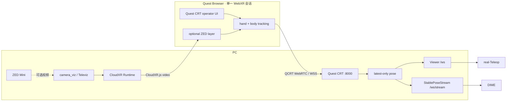

# Quest CRT

> **Quest 人体姿态是主链路，ZED 立体视频按需开启。** 一个浏览器入口、一个 WebXR
> 会话、两条彼此隔离的数据管线。

Quest CRT 从 Quest Browser 采集双手、肩和肘，在头显内构造稳定的人体坐标系，并向
real-Teleop 与 DIME 提供低延迟、latest-only 的实时数据。需要现场视觉时，可在同一
WebXR 会话中附加 ZED Mini → Televiz → CloudXR 视频；视频故障不会带停姿态服务。

| 能力 | 默认 | 稳定契约 |
|---|---:|---|
| 人体姿态上行 | 开启 | QCRT 628 B WebRTC；WSS JSON 回退 |
| real-Teleop 输出 | 开启 | `:8001/ws`，事件驱动 JSON |
| DIME 传感流 | 开启 | `:8001/ws/stream`，72 Hz QSTR v1 |
| ZED 视频回传 | **关闭** | 每眼 1280×720 @ 60 FPS，CloudXR |

## 架构



核心设计约束：

- **姿态优先**：`:8000` 是产品入口；视频开关默认关闭。
- **单会话**：视频模式复用 CloudXR.js 创建的同一个 `XRSession` 采集 QCRT，不创建
  第二个沉浸式会话。
- **故障隔离**：视频、相机、姿态服务和短时网络故障分别恢复，不互相绑定生命周期。
- **薄适配**：不 vendoring NVIDIA Web Client、IsaacTeleop、Televiz 或 ZED SDK；构建时
  只注入一个经过校验的 QCRT exporter。
- **下游冻结**：原有 QCRT、QSTR、`/ws`、`/ws/stream`、坐标与 Python API 保持兼容。

## 两种运行模式

### 1. 姿态模式（默认）

浏览器直接使用 Quest CRT 页面。唯一一次 **Start prep** 点击进入 XR，3 秒摆姿倒计时
期间不发送数据；结束后自动开始上行。

### 2. 姿态 + ZED 视频

在主入口勾选 **Video return** 后立即进入同风格的视频准备页，再点击一次
**Start prep**。与姿态模式相比，XR 中只增加 ZED 弧面视频层；NVIDIA 控制面板、控制器
模型、轨迹和录制控件默认隐藏。原始 NVIDIA 页面仍可从 **Advanced settings** 打开。

关闭视频开关会回到姿态模式。

## 快速开始

### 基础要求

- Python 3.13+
- [`uv`](https://docs.astral.sh/uv/)
- 支持 hand/body tracking 的 Quest Browser
- Quest 与 PC 位于互通的局域网

```bash
git clone git@github.com:TianyuChai-creature/quest-crt.git
cd quest-crt
uv sync
```

### 只运行姿态

```bash
uv run python server.py
```

终端会打印局域网地址：

```text
Quest page: https://<PC-IP>:8000/
3D viewer:  https://<PC-IP>:8001/
```

在 Quest Browser 打开 `https://<PC-IP>:8000/`，首次访问接受开发证书，然后点击
**Start prep**。PC 端可打开 `https://<PC-IP>:8001/` 查看 46 点 Viewer。

### 启用 ZED + CloudXR

额外要求：

- NVIDIA GPU 与兼容驱动
- ZED SDK、`pyzed`、CuPy
- IsaacTeleop `examples/camera_viz` 的独立 `.venv`
- CloudXR Runtime / CloudXR.js，并由使用者接受 NVIDIA CloudXR EULA

```bash
CAMERA_VIZ_DIR=/path/to/IsaacTeleop/examples/camera_viz \
  ./scripts/run_cloudxr_zed.sh --check

CAMERA_VIZ_DIR=/path/to/IsaacTeleop/examples/camera_viz \
  ./scripts/run_cloudxr_zed.sh
```

启动器会：

1. 从已安装的 NVIDIA Web Client 生成忽略于 Git 的 `.cloudxr-client/`；
2. 校验官方 DOM 挂接点，并在 `bundle.js` 前注入 QCRT exporter；
3. 重启本地 CloudXR host-client；
4. 立即启动姿态服务并复用 CloudXR 证书；
5. 等到用户真正完成 CloudXR `/sign_in` 后才创建 camera_viz OpenXR 应用；
6. camera_viz 退出时继续保留姿态服务。

最终验收配置见
[`cloudxr/camera_viz_zed_60fps.yaml`](cloudxr/camera_viz_zed_60fps.yaml)：原生 ZED
双目视差、头锁定 102° 弧面、每眼 1280×720 @ 60 FPS。

## 稳定接口

| 端口 | 路径 | 消费方 | 节奏 | 格式 |
|---:|---|---|---|---|
| 8000 | `/api/webrtc/offer` | Quest | 会话协商 | SDP JSON |
| 8000 | WebRTC `pose` | Quest → PC | XR 帧驱动 | QCRT 628 B |
| 8000 | `/ws` | Quest → PC 回退 | XR 帧驱动 | Pose JSON |
| 8000 | `/health` | 运维 | 按需 | JSON |
| 8000/8001 | `/api/coordinate-transform` | 运维 | 按需 | JSON |
| 8001 | `/ws` | real-Teleop / Viewer | 事件驱动 latest | JSON |
| 8001 | `/ws/stream` | DIME | 固定 72 Hz | QSTR v1（二进制默认） |

兼容保证：

- 当前 628 字节 QCRT 与旧 604 字节帧都可解码；
- Pose v2 旧 JSON 与 Pose v4 人体坐标帧都受支持；
- `/ws` 继续输出 shoulders、elbows、wrist pose 与每手 21 个腕部局部 landmarks；
- `/ws/stream` 继续输出 `quality=ok|held|stale|lost` 的 QSTR v1；
- `quest_crt` 公共 Python 导出、坐标预设与二进制编解码 API 未改变；
- WebRTC 不可用时仍自动回退到 WSS，下一次完整会话优先恢复 WebRTC。

### 坐标语义

Quest 同帧读取 `spine-upper` 与左右 `scapula`，构造以上背部为原点的右手坐标系：

```text
X = 前    Y = 上    Z = 右    单位 = 米
```

`:8001` 默认使用 `body` 预设，并将双手 21 点转换为各自腕部局部坐标；肩、肘、腕仍在
人体坐标中。详细数学定义与字段表见
[`ENGINEERING_MANUAL.md`](ENGINEERING_MANUAL.md)。

## 检查与测试

Quest 已传数时：

```bash
# 健康、WebRTC 与 72 Hz QSTR
uv run python scripts/check_stream.py --seconds 5

# 只读验证真实 /ws 与 /ws/stream 下游契约
uv run python scripts/check_runtime_contracts.py --live
```

完整测试：

```bash
PYTHONPATH=. python -m unittest discover -s tests -v
```

测试固定了原有 HTTP/WSS 路由、604/628 字节 QCRT、QSTR、坐标变换、latest-only、日志
轮转、遥测和 CloudXR 注入边界。

## 故障语义

| 故障 | 预期行为 |
|---|---|
| ZED 拔出 | 视频停止；camera_viz 每 2 秒重连；姿态继续 |
| ZED 插回 | 无需重启，自动恢复 60 FPS |
| camera_viz 退出 | 视频停止；`:8000` 姿态服务继续 |
| quest-crt 重启 | 视频继续；姿态先以 WSS 恢复，完整重连优先 WebRTC |
| Quest 短时断网 | QSTR 进入 held/stale/lost；网络恢复后两条链路自动恢复 |
| CloudXR UI 结构变化 | `prepare_cloudxr_client.py` fail-fast，不生成半坏客户端 |

## 配置

常用环境变量：

| 变量 | 默认值 | 说明 |
|---|---:|---|
| `POSE_PORT` | `8000` | Quest、信令和上行 WSS |
| `OUTPUT_PORT` | `8001` | Viewer 与下游流 |
| `POSE_LOG_ENABLED` | `1` | JSONL 日志；一体化启动器默认设为 `0` |
| `STREAM_HZ` | `72` | StablePoseStream 频率 |
| `POSE_CERT_FILE` / `POSE_KEY_FILE` | 自动生成 | 必须成对设置的外部 TLS 文件 |
| `CAMERA_VIZ_DIR` | 无 | IsaacTeleop camera_viz 目录 |
| `CAMERA_CONFIG` | ZED 720p60 配置 | 一体化相机配置 |
| `QUEST_WAIT_SECONDS` | `0` | 等待可选 CloudXR sign-in；`0` 为无限等待 |

开发证书、JSONL、遥测字段、UDP 旁路和全部变量见工程手册。

## 仓库结构

```text
quest-crt/
├── server.py                  # FastAPI、WebRTC/WSS、latest ingress、日志
├── quest_crt/                 # 稳定协议、坐标、流时钟与遥测
├── static/                    # 姿态主入口与 PC Viewer
├── cloudxr/                   # ZED 配置与同会话 QCRT exporter
├── scripts/                   # 预检、启动与运行时契约检查
├── tests/                     # 单元与公开接口回归
├── ENGINEERING_MANUAL.md      # 字段级协议、部署与故障排查
└── CLOUDXR_INTEGRATION_WORKFLOW.md  # H1–H6 实机验证记录
```

## 文档与许可

- [工程手册](ENGINEERING_MANUAL.md)：部署、字段级协议、JSONL、坐标和排障
- [CloudXR + ZED 验证记录](CLOUDXR_INTEGRATION_WORKFLOW.md)：硬件、质量矩阵与 H1–H6
- [Stereolabs ZED SDK](https://www.stereolabs.com/developers/)
- [NVIDIA CloudXR](https://developer.nvidia.com/cloudxr-sdk)
- [NVIDIA IsaacTeleop](https://github.com/NVIDIA/IsaacTeleop)

本仓只保存自身代码、配置和薄适配器，不分发 CloudXR、IsaacTeleop、Televiz、ZED SDK
或其模型/二进制。安装和使用这些组件前，请分别审阅并接受对应上游许可。

## 项目边界

- 局域网开发部署默认无应用层鉴权；不要直接暴露到公网。
- 当前只允许一个活动 Quest 姿态源，第二个源会被拒绝。
- 不包含机器人控制器、安全停机策略或机械臂驱动；这些属于 real-Teleop。
- 不包含 DIME 的 21→20 数据转换、训练和权重。
- 传统姿态-only 页面始终保留，是视频链路不可用时的回滚路径。
